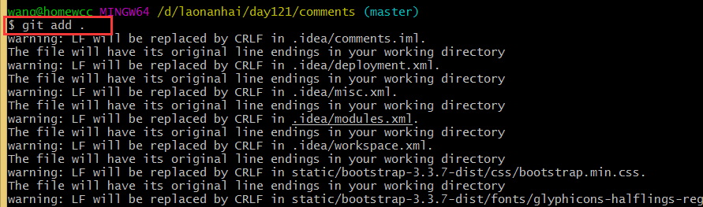
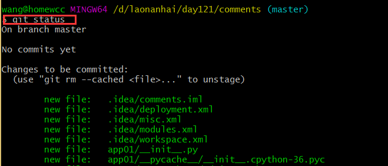
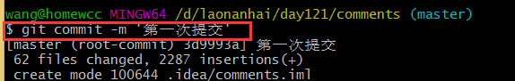
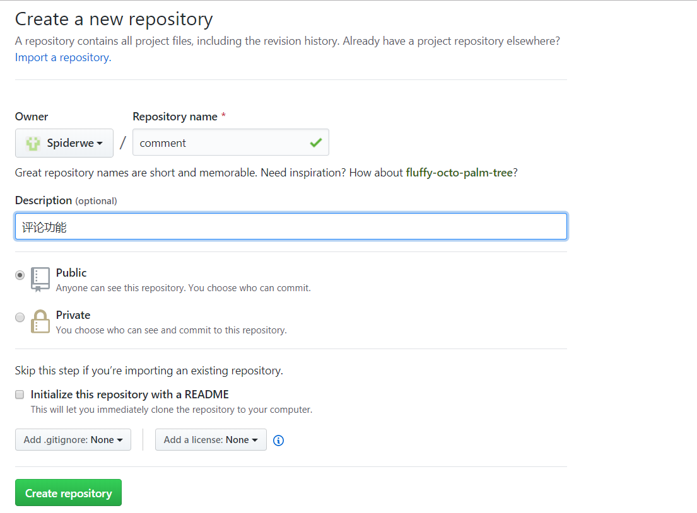
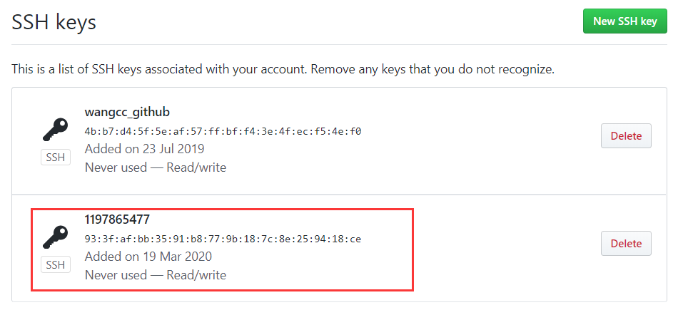
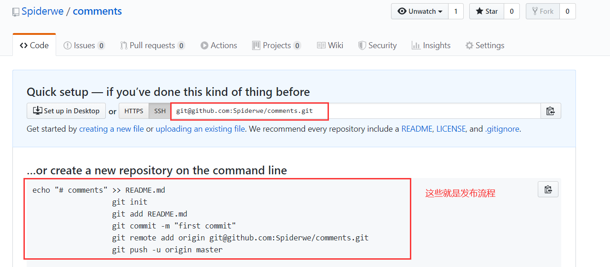
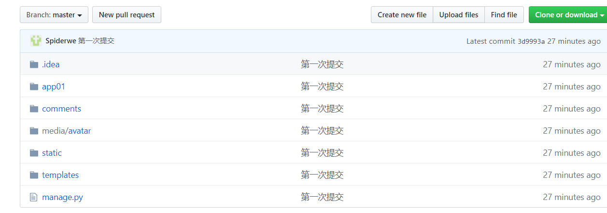

# 使用git将代码推送到github

教程地址：https://www.runoob.com/w3cnote/git-guide.html

教程地址2：https://www.cnblogs.com/wangcuican/p/12522239.html

### 一、基本流程

**先简单了解一下本地代码提交到github的流程：大致分为以下四步**

1. 需要先把本地代码文件夹初始化成git仓库
2. 本地代码文件夹叫做工作区，先需要把工作区的代码存到暂存区，通过git add .
3. 然后将暂存区的代码提交到本地的版本库  通过git commit -m '提交信息'
4. 最后将本地版本库提交到github仓库

### 二、详细步骤

**下面详细的操作一遍：(在这操作之前，你需要安装git客户端，自行百度安装)**

#### **1.将文件夹初始化成git仓库**

P.S：也可以使用git bash客户端到相应目录下执行命令: 

```shell
cd $要初始化的目录
git init
# 初始化成功后，会生成文件.git
```


#### 2.将本地代码放入暂存区



#### 3.输入git status 查看文件都是显示绿色



#### 4.输入git commit -m ' 提交信息'  把暂存区的文件放到版本库中（如果你没有创建用户信息，会让你创建一个,邮箱和用户名随便填）

#### 5.到github上创建一个仓库



#### **6.如果你是第一次使用，需要部署公钥(如果在最后一步将代码提交到github出现因为公钥报错，那就新建一个公钥)**

**创建公钥**

```shell
本机命令，生成公钥：ssh-keygen -t rsa -C "*@*.com"  邮箱可以任意填写
本机命令，查看公钥：cat ~/.ssh/id_rsa.pub   查看之后然后copy

github线上添加公钥：项目仓库 => settings => SSH and GPG keys => New SSH key 
```



#### 7.本地仓库与远程仓库建立连接，添加远程源，这里我们采用ssh协议的remote源

```shell
        git remote add origin git@github.com:TongTsing/UNIX.git      #origin是远程源的名字
```



###  8.提交本地仓库代码到远程仓库

```shell
git push -u origin master    origin是远程源的源名，可以自定义；master是分支名，是默认的主分支
```

提交到github了



#### 9.需要拉取远程仓库代码时，可以执行下面

```shell
git pull origin{远程源的源名} master{分支名称}
```